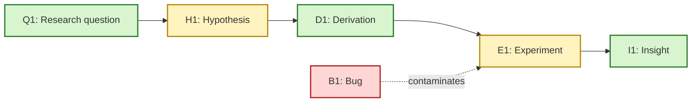

```mermaid
flowchart LR
%% Node classes
classDef trusted fill:#d8f5d0,stroke:#2b7a2b,stroke-width:2px;
classDef provisional fill:#fff3bf,stroke:#b8860b,stroke-width:2px;
classDef questioned fill:#ffd6d6,stroke:#b22222,stroke-width:2px;
classDef deprecated fill:#e5e5e5,stroke:#777,stroke-width:1px;
classDef current fill:#d6e8ff,stroke:#1f5fbf,stroke-width:3px;

%% Nodes
Q1["Q1: Research question"]
H1["H1: Hypothesis"]
D1["D1: Derivation"]
E1["E1: Experiment"]
I1["I1: Insight"]
B1["B1: Bug"]

%% Edges
Q1 --> H1
H1 --> D1
D1 --> E1
E1 --> I1
B1 -. contaminates .-> E1

%% Class assignments
class Q1,D1,I1 trusted;
class H1,E1 provisional;
class B1 questioned;
```